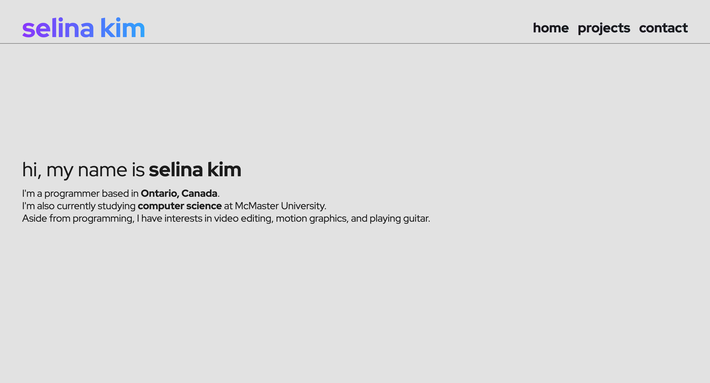

# Personal Website

    
    Live at:
        <a href="https://selinakim.me">
            <b>selinakim.me</b>
        </a>

Personal website built with Astro.js, Tailwind CSS, and TypeScript. Deployed with Netlify.

### Initial Prototype Sketch in Figma

    
    
    

### Commands

All commands are run from the root of the project, from a terminal:

| Command                 | Action                                             |
| :---------------------- | :------------------------------------------------- |
| `npm install`           | Installs dependencies                              |
| `npm run dev`           | Starts local dev server at `localhost:3000`        |
| `npm run build`         | Build your production site to `./dist/`            |
| `npm run preview`       | Preview your build locally, before deploying       |
| `npm run astro ...`     | Run CLI commands like `astro add`, `astro preview` |
| `npm run astro --help`  | Get help using the Astro CLI                       |
| `netlify deploy --prod` | Deploy via Netlify CLI                             |

### TODO
- Smooth Scrolling
- Light/Dark Mode Toggle
